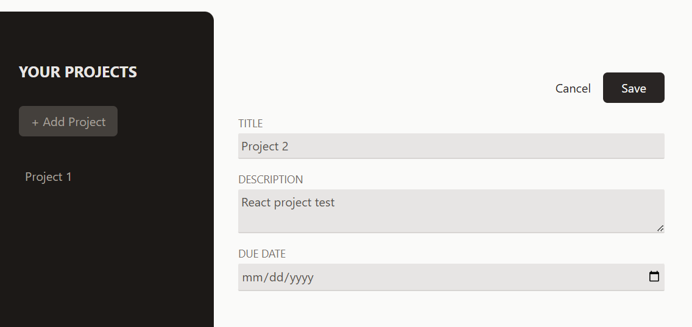
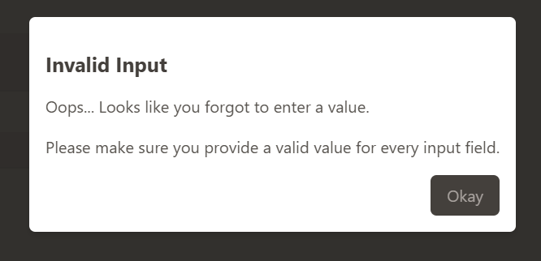
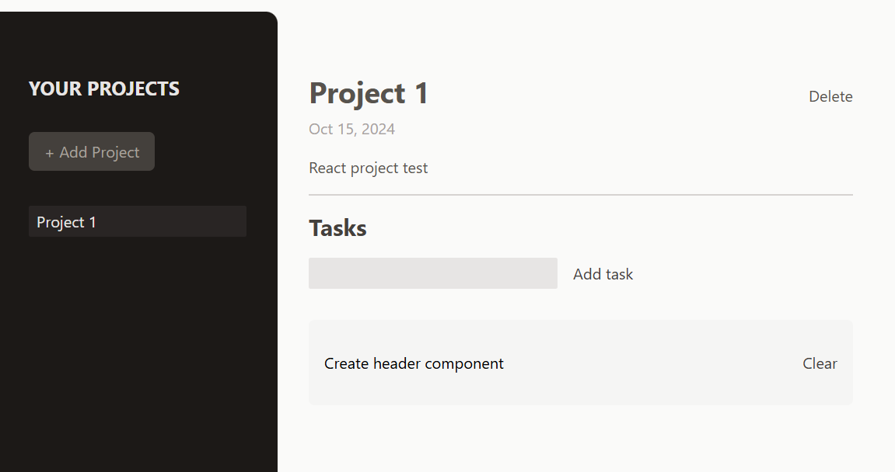

# React Project Managment

This small project, developed with React, focuses on managing user projects and their associated tasks. By leveraging components, I was able to achieve cleaner and more organized code.

## Table of contents

- [Overview](#overview)
  - [Screenshot](#screenshot)
- [My process](#my-process)
  - [Built with](#built-with)
  - [What I learned](#what-i-learned)
  - [Continued development](#continued-development)
  - [Useful resources](#useful-resources)
- [Author](#author)
- [Acknowledgments](#acknowledgments)

## Overview

### Screenshot







## My process

### Built with

- React
- CSS Tailwind

### What I learned

While working on this project, I deepened my skills in building React applications by utilizing several advanced hooks and techniques. Specifically, I employed forwardRef and useImperativeHandle to create more flexible components, and useRef for managing references. Additionally, I implemented the createPortal method to handle the error modal, ensuring it renders correctly outside the main DOM hierarchy. These tools and methods allowed me to create a more robust and responsive user interface.

```js
const Modal = forwardRef(function Modal({ children, buttonCaption }, ref) {
  const dialog = useRef();

  useImperativeHandle(ref, () => {
    return {
      open() {
        dialog.current.showModal();
      },
    };
  });
});
```

```js
return createPortal(
  <dialog
    ref={dialog}
    className="backdrop:bg-stone-900/90 p-4 rounded-md shadow-md"
  >
    {children}
    <form method="dialog" className="mt-4 text-right">
      <Button>{buttonCaption}</Button>
    </form>
  </dialog>,
  document.getElementById("modal-root")
);
```

### Continued development

My goal is to further enhance my understanding of React hooks and custom hooks as I develop the app and ensure seamless integration with the backend.

### Useful resources

- [Example resource 1](https://www.udemy.com) - I developed this small application through the course Dive in and learn React.js from scratch! by Maximilian Schwarzmüller - Udemy.

## Author

- Website - [Daniela Serrano](https://github.com/danielaser)

## Acknowledgments

As a junior developer, I found the Udemy course Dive in and Learn React.js from Scratch! by Maximilian Schwarzmüller to be incredibly valuable. It has helped me create cleaner React applications and gain a better understanding of key concepts.
